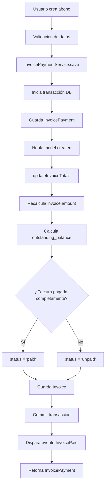

# Flujo de Abonos a Facturas (InvoicePayment)

## 📋 Descripción General

El sistema de **Abonos a Facturas** (InvoicePayment) permite registrar pagos parciales o completos aplicados a una factura. Este mecanismo reduce el saldo pendiente (`outstanding_balance`) sin modificar el total original de la factura.

### Diferencia con otros conceptos:
- **InvoicePayment (Abonos)**: Pagos parciales o completos que reducen el saldo pendiente
- **CreditNote (Notas de Crédito)**: Ajustes, descuentos o reembolsos que modifican el total de la factura
- **InvoiceAdjustment**: Cargos adicionales, impuestos o anulaciones

---

## 🏗️ Arquitectura del Sistema

### Estructura de Archivos

```
app/
├── Models/Invoice/
│   ├── Invoice.php              # Modelo principal de factura
│   └── InvoicePayment.php       # Modelo de abonos
├── Services/Invoice/
│   └── InvoicePaymentService.php # Lógica de negocio
├── Repositories/App/Models/Invoice/
│   └── InvoicePaymentRepository.php # Acceso a datos
├── Http/
│   ├── Controllers/API/Invoice/
│   │   └── InvoicePaymentController.php # API REST
│   ├── Requests/Invoice/
│   │   └── InvoicePaymentRequest.php    # Validaciones
│   └── Resources/Invoice/
│       └── InvoicePaymentResource.php   # Transformación de datos
└── Nova/Invoice/
    └── InvoicePayment.php       # Panel administrativo Nova

database/migrations/
└── 2026_01_08_173755_create_invoice_payments_table.php

routes/
└── api_v1.php                   # Rutas API REST
```

---

## 💾 Modelo de Datos

### Tabla: `invoice_payments`

| Campo | Tipo | Descripción |
|-------|------|-------------|
| `id` | bigint | ID único del abono |
| `invoice_id` | bigint | Referencia a la factura (FK) |
| `user_id` | bigint | Usuario que registró el pago (FK) |
| `amount` | decimal(10,2) | Monto del abono |
| `payment_date` | date | Fecha del pago |
| `payment_method` | string | Método: cash, transfer, card, online |
| `reference_number` | string | Número de referencia o transacción |
| `notes` | text | Notas adicionales |
| `payment_support` | string | Ruta del comprobante de pago |
| `additional_information` | json | Metadata adicional |
| `created_at` | timestamp | Fecha de creación del registro |
| `updated_at` | timestamp | Última actualización |

### Relaciones

```php
// InvoicePayment
belongsTo(Invoice::class)      // Un abono pertenece a una factura
belongsTo(User::class)          // Un abono fue registrado por un usuario

// Invoice
hasMany(InvoicePayment::class)  // Una factura puede tener múltiples abonos
```

---

## 🔄 Flujo de Procesamiento

### 1. Creación de un Abono



### 2. Cálculo de Saldos

El sistema mantiene múltiples campos para rastrear el estado de pago:

```php
// En el modelo Invoice
public function getTotalPaidAttribute(): float
{
    return $this->amount ?? 0; // Suma de todos los pagos
}

public function getCreditNotesTotalAttribute(): float
{
    return $this->creditNotes()->sum('amount'); // Notas de crédito
}

public function getRealOutstandingBalanceAttribute(): float
{
    return max(0, $this->total - $this->amount - $this->credit_notes_total);
}

public function isFullyPaid(): bool
{
    return $this->real_outstanding_balance <= 0;
}
```

**Fórmula clave:**
```
outstanding_balance = total - amount - credit_notes_total
```

Donde:
- `total`: Monto total de la factura
- `amount`: Suma de todos los pagos (actualizado automáticamente)
- `credit_notes_total`: Suma de notas de crédito aplicadas

---

## 🔧 Implementación Actual

### A. Modelo InvoicePayment

**Ubicación:** `app/Models/Invoice/InvoicePayment.php`

#### Características Clave:

1. **Auto-actualización mediante Events**
```php
protected static function boot(): void
{
    parent::boot();

    // Cuando se crea un pago
    static::created(function ($payment) {
        $payment->updateInvoiceTotals();
    });

    // Cuando se actualiza
    static::updated(function ($payment) {
        $payment->updateInvoiceTotals();
    });

    // Cuando se elimina
    static::deleted(function ($payment) {
        $payment->updateInvoiceTotals();
    });
}
```

2. **Actualización de totales**
```php
protected function updateInvoiceTotals(): void
{
    $invoice = $this->invoice;
    
    // Recalcula el monto pagado (suma de todos los abonos)
    $invoice->amount = $invoice->payments()->sum('amount');
    $invoice->outstanding_balance = $invoice->real_outstanding_balance;

    // Actualiza el estado
    if ($invoice->isFullyPaid()) {
        $invoice->status = 'paid';
        $invoice->outstanding_balance = 0;
    } else if ($invoice->status === 'paid') {
        $invoice->status = 'unpaid';
    }

    $invoice->save();
}
```

### B. Service Layer

**Ubicación:** `app/Services/Invoice/InvoicePaymentService.php`

#### Métodos principales:

1. **Crear abono**
```php
public function save(array $data): InvoicePayment
{
    DB::beginTransaction();
    try {
        $payment = $this->invoicePaymentRepository->save($data);
        
        // El modelo InvoicePayment automáticamente actualiza la factura
        // mediante los event hooks (created, updated, deleted)
        
        DB::commit();
        return $payment;
    } catch (Exception $e) {
        DB::rollBack();
        throw new InvalidArgumentException('Unable to save payment: ' . $e->getMessage());
    }
}
```

2. **Actualizar abono**
```php
public function update(array $data, int $id): InvoicePayment
{
    DB::beginTransaction();
    try {
        $payment = $this->invoicePaymentRepository->update($data, $id);
        
        // El hook updated() recalculará automáticamente los totales
        
        DB::commit();
        return $payment;
    } catch (Exception $e) {
        DB::rollBack();
        throw new InvalidArgumentException('Unable to update payment: ' . $e->getMessage());
    }
}
```

3. **Eliminar abono**
```php
public function deleteById(int $id): bool
{
    DB::beginTransaction();
    try {
        $payment = $this->invoicePaymentRepository->getById($id);
        
        $this->invoicePaymentRepository->delete($id);
        
        // El hook deleted() recalculará automáticamente los totales
        
        DB::commit();
        return true;
    } catch (Exception $e) {
        DB::rollBack();
        throw new InvalidArgumentException('Unable to delete payment: ' . $e->getMessage());
    }
}
```

### C. API REST Controller

**Ubicación:** `app/Http/Controllers/API/Invoice/InvoicePaymentController.php`

**Rutas disponibles:** (definidas en `routes/api_v1.php`)
```php
Route::apiResource('/invoice-payments', InvoicePaymentController::class);
```

Esto genera las siguientes rutas:

| Método | Ruta | Acción | Descripción |
|--------|------|--------|-------------|
| GET | `/api/v1/invoice-payments` | index | Listar todos los abonos |
| POST | `/api/v1/invoice-payments` | store | Crear nuevo abono |
| GET | `/api/v1/invoice-payments/{id}` | show | Ver un abono específico |
| PUT/PATCH | `/api/v1/invoice-payments/{id}` | update | Actualizar abono |
| DELETE | `/api/v1/invoice-payments/{id}` | destroy | Eliminar abono |

#### Ejemplo de uso:

**Crear abono:**
```bash
POST /api/v1/invoice-payments
Content-Type: application/json
Authorization: Bearer {token}

{
  "invoice_id": 123,
  "amount": 50000,
  "payment_date": "2026-01-14",
  "payment_method": "transfer",
  "reference_number": "TRX123456",
  "notes": "Abono parcial del cliente"
}
```

**Respuesta:**
```json
{
  "data": {
    "id": 1,
    "invoice_id": 123,
    "user_id": 5,
    "amount": 50000,
    "payment_date": "2026-01-14",
    "payment_method": "transfer",
    "reference_number": "TRX123456",
    "notes": "Abono parcial del cliente",
    "created_at": "2026-01-14T16:00:00.000000Z",
    "updated_at": "2026-01-14T16:00:00.000000Z"
  }
}
```

### D. Panel Nova

**Ubicación:** `app/Nova/Invoice/InvoicePayment.php`

#### Campos disponibles:

- **ID:** Identificador único
- **Factura:** Relación BelongsTo (readonly)
- **Usuario:** Quien registró el pago (readonly)
- **Monto:** Campo Currency con validación
- **Fecha de Pago:** Campo Date
- **Método de Pago:** Select (Efectivo, Transferencia, Tarjeta, En línea)
- **Referencia:** Número de referencia
- **Notas:** Campo de texto
- **Comprobante:** Ruta al archivo
- **Información Adicional:** KeyValue (readonly)

#### Permisos:
```php
- viewAnyInvoicePayment
- viewInvoicePayment
- createInvoicePayment
- updateInvoicePayment
- deleteInvoicePayment
- destroyInvoicePayment
```

---

## 🔐 Seguridad y Validaciones

### Validaciones en InvoicePaymentRequest

```php
public function rules()
{
    return [
        'invoice_id' => 'required|exists:invoices,id',
        'amount' => 'required|numeric|min:0.01',
        'payment_date' => 'required|date',
        'payment_method' => 'nullable|in:cash,transfer,card,online',
        'reference_number' => 'nullable|string|max:255',
        'notes' => 'nullable|string',
    ];
}
```

### Reglas de negocio:

1. ✅ No se puede abonar más del saldo pendiente
2. ✅ El monto debe ser mayor a 0
3. ✅ Los abonos actualizan automáticamente el estado de la factura
4. ✅ Al eliminar un abono, se recalculan los totales
5. ✅ Se registra el usuario que crea el abono

---

## 🚀 Implementación GraphQL

### Consideraciones para GraphQL

Para implementar una API GraphQL basada en este flujo, considera lo siguiente:

#### 1. Schema GraphQL Propuesto

```graphql
type InvoicePayment {
  id: ID!
  invoice: Invoice!
  user: User!
  amount: Float!
  paymentDate: Date!
  paymentMethod: PaymentMethod
  referenceNumber: String
  notes: String
  paymentSupport: String
  additionalInformation: JSON
  createdAt: DateTime!
  updatedAt: DateTime!
}

enum PaymentMethod {
  CASH
  TRANSFER
  CARD
  ONLINE
}

input CreateInvoicePaymentInput {
  invoiceId: ID!
  amount: Float!
  paymentDate: Date!
  paymentMethod: PaymentMethod
  referenceNumber: String
  notes: String
}

input UpdateInvoicePaymentInput {
  amount: Float
  paymentDate: Date
  paymentMethod: PaymentMethod
  referenceNumber: String
  notes: String
}

type Query {
  invoicePayments(invoiceId: ID): [InvoicePayment!]!
  invoicePayment(id: ID!): InvoicePayment
}

type Mutation {
  createInvoicePayment(input: CreateInvoicePaymentInput!): InvoicePayment!
  updateInvoicePayment(id: ID!, input: UpdateInvoicePaymentInput!): InvoicePayment!
  deleteInvoicePayment(id: ID!): Boolean!
}
```

#### 2. Resolvers

Puedes reutilizar el `InvoicePaymentService` existente:

```php
// Ejemplo de resolver para Lighthouse PHP o similar
namespace App\GraphQL\Mutations;

use App\Services\Invoice\InvoicePaymentService;

class InvoicePaymentMutations
{
    protected $service;
    
    public function __construct(InvoicePaymentService $service)
    {
        $this->service = $service;
    }
    
    public function createInvoicePayment($root, array $args)
    {
        $data = $args['input'];
        $data['user_id'] = auth()->id();
        
        return $this->service->save($data);
    }
    
    public function updateInvoicePayment($root, array $args)
    {
        return $this->service->update($args['input'], $args['id']);
    }
    
    public function deleteInvoicePayment($root, array $args)
    {
        return $this->service->deleteById($args['id']);
    }
}
```

#### 3. Integración con Backend Existente

**Ventajas:**
- ✅ Reutilizas toda la lógica de negocio existente
- ✅ Las transacciones DB están manejadas en el Service
- ✅ Los event hooks funcionan automáticamente
- ✅ Las validaciones están centralizadas

**Recomendaciones:**
1. Usa **Lighthouse PHP** como servidor GraphQL
2. Instala: `composer require nuwave/lighthouse`
3. Define el schema en `graphql/schema.graphql`
4. Crea directivas personalizadas para permisos
5. Reutiliza `InvoicePaymentService` en los resolvers

#### 4. Ejemplo de Query GraphQL

```graphql
# Obtener abonos de una factura
query GetInvoicePayments {
  invoicePayments(invoiceId: "123") {
    id
    amount
    paymentDate
    paymentMethod
    referenceNumber
    user {
      id
      name
    }
  }
}

# Crear un abono
mutation CreatePayment {
  createInvoicePayment(input: {
    invoiceId: "123"
    amount: 50000
    paymentDate: "2026-01-14"
    paymentMethod: TRANSFER
    referenceNumber: "TRX123456"
    notes: "Abono parcial"
  }) {
    id
    amount
    invoice {
      id
      outstandingBalance
      status
    }
  }
}
```

---

## 📊 Diagramas de Flujo

### Flujo de actualización automática

```
[Crear/Actualizar/Eliminar InvoicePayment]
    ↓
[Event Hook: created/updated/deleted]
    ↓
[updateInvoiceTotals()]
    ↓
[Recalcula invoice.amount = SUM(payments.amount)]
    ↓
[Calcula outstanding_balance = total - amount - credit_notes]
    ↓
[Actualiza invoice.status]
    ↓
[Guarda Invoice]
    ↓
[Dispara InvoicePaid event si aplica]
```

---

## 🧪 Testing

### Casos de prueba recomendados:

1. ✅ Crear abono parcial
2. ✅ Crear abono que completa el pago
3. ✅ Actualizar monto de abono
4. ✅ Eliminar abono y verificar recalculos
5. ✅ Validar que no se pueda abonar más del saldo
6. ✅ Verificar evento InvoicePaid
7. ✅ Probar con múltiples abonos

---

## 📝 Notas Importantes

### Diferencia entre `applyPayment()` y `InvoicePayment`

El modelo `Invoice` tiene un método `applyPayment()` que:
- Cuando `$createPaymentRecord = true`: Crea un registro en `invoice_payments`
- Cuando `$createPaymentRecord = false`: Actualiza directamente `invoice.amount`

**Uso recomendado:**
- `InvoicePayment` (API/Nova): Para pagos que requieren trazabilidad detallada
- `applyPayment(false)`: Para comandos automáticos o pagos sin desglose

### Gestión de Transacciones

Todos los métodos del `InvoicePaymentService` usan transacciones DB:
```php
DB::beginTransaction();
try {
    // operaciones
    DB::commit();
} catch (Exception $e) {
    DB::rollBack();
    throw $e;
}
```

Esto garantiza consistencia de datos.

---

## 🔗 Referencias Adicionales

- **Modelo Invoice:** `app/Models/Invoice/Invoice.php`
- **Listener AfterPayingInvoice:** `app/Listeners/AfterPayingInvoice.php`
- **Evento InvoicePaid:** `app/Events/InvoicePaid.php`
- **Swagger/OpenAPI:** Documentación en controlador con anotaciones `@OA\`

---

## 📞 Contacto

Para más información sobre la implementación GraphQL o dudas sobre el flujo:
- Revisar `app/Services/Invoice/InvoicePaymentService.php`
- Documentación de Lighthouse: https://lighthouse-php.com/
